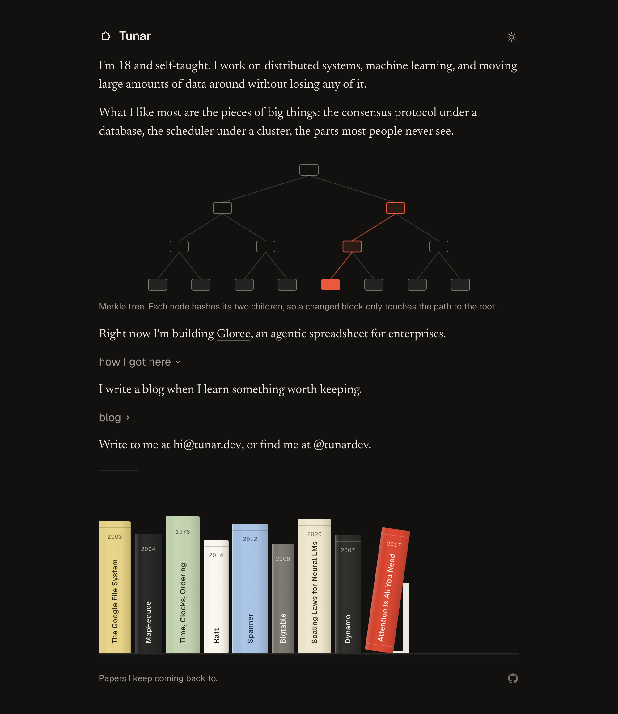

# tunar.dev

My personal site: a short introduction, a blog about how big systems actually work, and a four-in-a-row
opponent that learns from everyone who plays it.

Live at **[tunar.dev](https://tunar.dev)**.



## Stack

| | |
| --- | --- |
| Framework | Next.js 16 (App Router, Turbopack), React 19, TypeScript |
| Styling | Plain CSS Modules over a custom-property token layer |
| Type | Geist Sans, Newsreader |
| Data | Supabase Postgres for the game record, Supabase Realtime for friend matches |
| Model | TensorFlow.js to train, hand-written inference and alpha-beta search in the browser |
| Tooling | Biome, Husky, commitlint, GitHub Actions |
| Hosting | Vercel, with Vercel Analytics |

## Run it

```sh
bun install
bun dev
```

For the Supabase-backed parts, copy `.env.example` to `.env` and fill it in, then apply `supabase/schema.sql`
to your project.

```sh
bun run build      # production build
bun run typecheck  # tsc --noEmit
bun run lint       # biome
bun run analyze    # bundle report in .next/analyze
bun run train      # retrain the model into public/model/weights.json
```

## Deploy

Vercel, from the default branch. Set `NEXT_PUBLIC_SUPABASE_URL`, `NEXT_PUBLIC_SUPABASE_ANON_KEY`, and
`SUPABASE_SERVICE_ROLE_KEY` in the project, point the domain at it, and that is the whole deployment.

## Layout

```
content/blog/        posts, one Markdown file per slug
public/model/        trained weights, generated by bun run train
scripts/train.ts     the training run
src/app/             routes, metadata, sitemap, feed, OG images
src/components/      UI, the game, the SVG figures, the scene generator
src/lib/             posts, site constants, sounds, Supabase clients
supabase/schema.sql  tables and indexes
```

## Contributing

Read [CONTRIBUTING.md](CONTRIBUTING.md) before opening a pull request.

## License

[MIT](LICENSE).